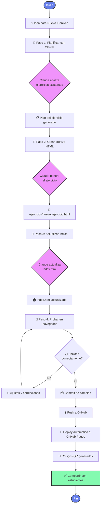
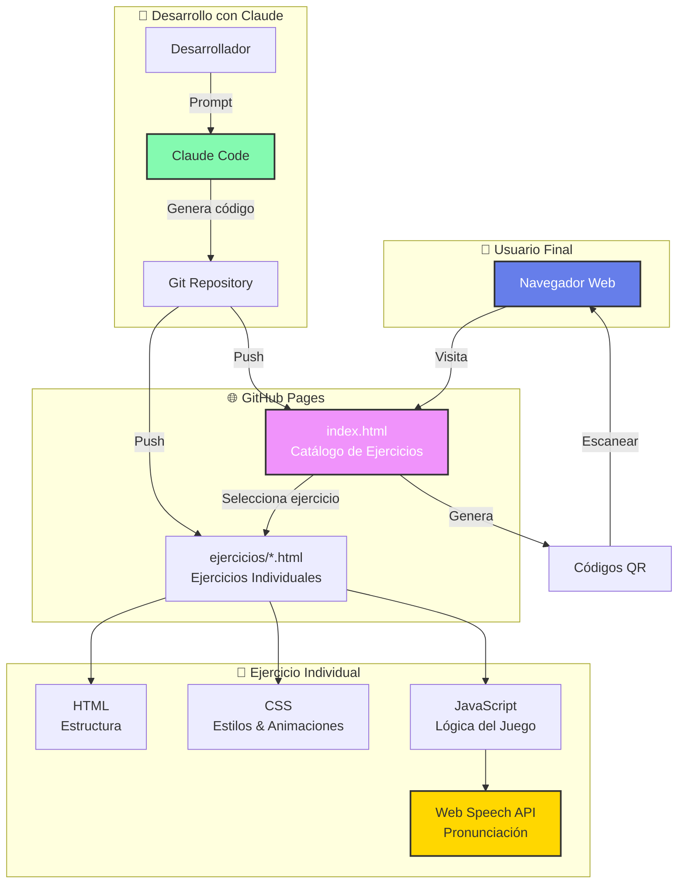

# Ejercicios Didácticos de Español

[](https://albecabrera.github.io/ejercicios-didActicos-espaNol-/)

**🔗 URL del sitio:** [https://albecabrera.github.io/ejercicios-didActicos-espaNol-/](https://albecabrera.github.io/ejercicios-didActicos-espaNol-/)

---

Plataforma de ejercicios interactivos para el aprendizaje del idioma español, diseñados especialmente para estudiantes de habla alemana.

## Objetivos del Proyecto

- **Aprendizaje Contextual**: Proporcionar ejercicios basados en situaciones reales y contextos culturales
- **Interactividad**: Ofrecer una experiencia de aprendizaje dinámica y entretenida
- **Accesibilidad**: Ejercicios que funcionan en cualquier navegador moderno, sin necesidad de instalación
- **Progresión Gradual**: Contenido organizado por niveles CEFR (A1, A2, B1, etc.)
- **Compartibilidad**: Sistema integrado de códigos QR para facilitar el acceso y distribución

## Características Principales

- Interface principal con catálogo de ejercicios
- Cada ejercicio es un archivo HTML autocontenido (sin dependencias externas)
- Sistema de generación de códigos QR para compartir ejercicios
- Diseño responsive adaptado a móviles y escritorio
- Integración con Web Speech API para pronunciación
- Sistema de puntos y estrellas para motivar el aprendizaje
- Sin necesidad de servidor o proceso de build

## Estructura del Proyecto

```
ejercicios_didacticos/
├── index.html              # Página principal con catálogo de ejercicios
├── ejercicios/             # Directorio con los ejercicios
│   └── mi_barrio_spiel.html    # Ejercicio: Madrid Abenteuer
├── CLAUDE.md              # Instrucciones para Claude Code
└── README.md              # Este archivo
```

## Ejercicios Disponibles

### Mi Barrio - Madrid Abenteuer
**Nivel**: A1-A2
**Temas**: Direcciones, lugares, comida, transporte, compras
**Archivo**: `ejercicios/mi_barrio_spiel.html`

Aventura interactiva que enseña vocabulario español a través de un recorrido por Madrid. Incluye 10 niveles con escenarios basados en situaciones reales.

## Cómo Agregar Nuevos Ejercicios Usando Claude

### Método Recomendado: Usar Claude Code

Claude Code puede ayudarte a crear nuevos ejercicios de forma eficiente. Aquí están los pasos y ejemplos de prompts:

#### Paso 1: Planificar el Ejercicio

**Ejemplo de prompt:**
```
Quiero crear un nuevo ejercicio de español nivel A2 sobre el tema "En el restaurante".
El ejercicio debe seguir el patrón de mi_barrio_spiel.html pero con un enfoque en vocabulario
de comida, bebidas y frases útiles para ordenar en un restaurante. Quiero que tenga 8 niveles.

Por favor, primero lee el archivo ejercicios/mi_barrio_spiel.html para entender la estructura
y luego crea un plan para el nuevo ejercicio.
```

#### Paso 2: Crear el Archivo del Ejercicio

**Ejemplo de prompt:**
```
Ahora crea el archivo ejercicios/restaurante_aventura.html con el contenido del ejercicio.
Incluye:
- 8 niveles/escenarios sobre situaciones en un restaurante
- Vocabulario relacionado con comida española (tapas, paella, gazpacho, etc.)
- Frases útiles como "Quisiera...", "La cuenta, por favor", etc.
- Mantén el mismo estilo visual y funcionalidad de texto-a-voz
- Interface en alemán, enseñando español
```

#### Paso 3: Actualizar el Índice Principal

**Ejemplo de prompt:**
```
Actualiza el archivo index.html para agregar el nuevo ejercicio "Restaurante Aventura"
al catálogo. Los detalles son:
- id: 'restaurante-aventura'
- icon: '🍽️'
- title: 'Restaurante Aventura'
- description: 'Aprende vocabulario sobre comida y bebidas en restaurantes españoles.
  Practica cómo ordenar, pedir la cuenta y más en 8 niveles interactivos.'
- file: 'ejercicios/restaurante_aventura.html'
- level: 'A2'
- topics: ['Comida', 'Restaurante', 'Vocabulario']
- language: 'DE → ES'
```

#### Paso 4: Probar el Ejercicio

**Ejemplo de prompt:**
```
Ahora abre el archivo ejercicios/restaurante_aventura.html en el navegador
para verificar que funciona correctamente.
```

### Otros Ejemplos de Prompts para Diferentes Ejercicios

#### Ejercicio de Gramática:
```
Crea un ejercicio interactivo para practicar los verbos regulares en presente en español.
Nivel A1. Debe tener:
- 10 frases con espacios en blanco para completar
- Opciones múltiples para cada verbo
- Feedback inmediato
- Sistema de puntuación
Sigue el estilo visual de los ejercicios existentes.
```

#### Ejercicio de Comprensión Auditiva:
```
Crea un ejercicio basado en diálogos cortos en español sobre "Presentaciones y saludos".
Nivel A1. Debe incluir:
- Botones de audio para escuchar cada diálogo
- Preguntas de comprensión después de cada diálogo
- Transcripción opcional que se puede mostrar/ocultar
- 6-8 diálogos diferentes
```

#### Ejercicio de Vocabulario Temático:
```
Crea un ejercicio de memoria (matching game) para aprender los números del 1 al 100 en español.
Nivel A1. Debe:
- Mostrar tarjetas que se pueden voltear
- Emparejar números escritos con su forma numérica
- Contar tiempo y número de intentos
- Tener 3 niveles de dificultad
```

### Plantilla Básica de Prompt

Para cualquier nuevo ejercicio, usa esta estructura:

```
Crea un nuevo ejercicio de español sobre [TEMA] nivel [NIVEL CEFR].

Requisitos:
1. Lee primero ejercicios/mi_barrio_spiel.html para entender la estructura
2. Crea ejercicios/[nombre_archivo].html con:
   - [Número] niveles/secciones
   - Vocabulario sobre [temas específicos]
   - [Tipo de actividad: opción múltiple, completar espacios, etc.]
   - Interface en alemán, enseñando español
   - Texto-a-voz en español
   - Sistema de puntos/estrellas
   - Diseño responsive
3. Actualiza index.html para agregar el ejercicio al catálogo
4. Usa estos metadatos:
   - id: '[id-del-ejercicio]'
   - icon: '[emoji]'
   - title: '[Título]'
   - description: '[Descripción detallada]'
   - level: '[A1/A2/B1/etc]'
   - topics: ['tema1', 'tema2']
```

### Flujo de Trabajo Visual



### Arquitectura del Sistema



## Deploy a GitHub Pages

### Configuración Inicial

1. **Actualizar configuración en index.html**

   Edita el archivo `index.html` y actualiza las constantes de configuración (líneas 351-353):

   ```javascript
   const GITHUB_USERNAME = 'tu-usuario-github';  // Cambia esto
   const REPO_NAME = 'ejercicios_didacticos';    // Nombre de tu repositorio
   ```

   **Con Claude:**
   ```
   Actualiza el GITHUB_USERNAME en index.html con "tu-usuario-github"
   ```

2. **Hacer commit de los cambios**

   ```bash
   git add .
   git commit -m "Configurar GitHub Pages"
   git push origin main
   ```

   **Con Claude:**
   ```
   Haz un commit con el mensaje "Configurar GitHub Pages" e incluye todos los cambios.
   Luego haz push al repositorio.
   ```

3. **Habilitar GitHub Pages**

   - Ve a tu repositorio en GitHub
   - Click en **Settings** (Configuración)
   - En el menú lateral, selecciona **Pages**
   - En **Source**, selecciona la rama **main**
   - En **Folder**, deja seleccionado **/ (root)**
   - Click en **Save**

4. **Esperar el despliegue**

   GitHub Pages puede tardar unos minutos en desplegar tu sitio. Recibirás una URL como:
   ```
   https://[tu-usuario].github.io/ejercicios_didacticos/
   ```

5. **Verificar el deploy**

   Visita la URL proporcionada por GitHub Pages. Deberías ver tu página principal con el catálogo de ejercicios.

### Actualizar el Sitio

Cada vez que hagas cambios:

```bash
git add .
git commit -m "Descripción de los cambios"
git push origin main
```

**Con Claude:**
```
Haz commit de los cambios con el mensaje "[tu mensaje]" y haz push
```

GitHub Pages actualizará automáticamente el sitio en 1-2 minutos.

### Compartir Ejercicios

Una vez desplegado:
- Cada ejercicio tendrá su propio URL: `https://[usuario].github.io/ejercicios_didacticos/ejercicios/[nombre].html`
- Los códigos QR se generarán automáticamente con la URL correcta
- Puedes compartir el código QR o el enlace directamente con estudiantes

## Tecnologías Utilizadas

- **HTML5**: Estructura de los ejercicios
- **CSS3**: Estilos con gradientes y animaciones
- **JavaScript Vanilla**: Lógica del juego sin frameworks
- **Web Speech API**: Pronunciación en español
- **QRCode.js**: Generación de códigos QR
- **GitHub Pages**: Hosting gratuito

## Buenas Prácticas para Nuevos Ejercicios

1. **Autocontenido**: Cada ejercicio debe ser un solo archivo HTML con CSS y JS embebido
2. **Responsive**: Diseñar para móvil primero, luego desktop
3. **Accesibilidad**: Usar tamaños de fuente legibles y suficiente contraste
4. **Sin dependencias externas**: Excepto librerías CDN bien establecidas (como QRCode.js)
5. **Vocabulario contextual**: Enseñar palabras y frases en contextos reales
6. **Feedback inmediato**: Proporcionar retroalimentación visual y auditiva
7. **Gamificación**: Incluir puntos, estrellas o algún sistema de recompensa

## Niveles CEFR Recomendados

- **A1**: Principiante absoluto (saludos, números, vocabulario básico)
- **A2**: Elemental (situaciones cotidianas, presente simple)
- **B1**: Intermedio (conversaciones sobre temas familiares)
- **B2**: Intermedio alto (textos complejos, opiniones)
- **C1**: Avanzado (textos largos, matices de significado)
- **C2**: Maestría (cualquier tipo de texto)

## Contribuir

Si deseas contribuir con nuevos ejercicios:

1. Fork el repositorio
2. Crea una nueva rama: `git checkout -b nuevo-ejercicio-[tema]`
3. Crea tu ejercicio siguiendo las pautas de este README
4. Haz commit de tus cambios
5. Push a tu fork
6. Abre un Pull Request

## Licencia

Este proyecto está diseñado con fines educativos.

## Soporte

Para preguntas o sugerencias, abre un issue en el repositorio de GitHub.

---

Desarrollado con para la educación y el aprendizaje del español
